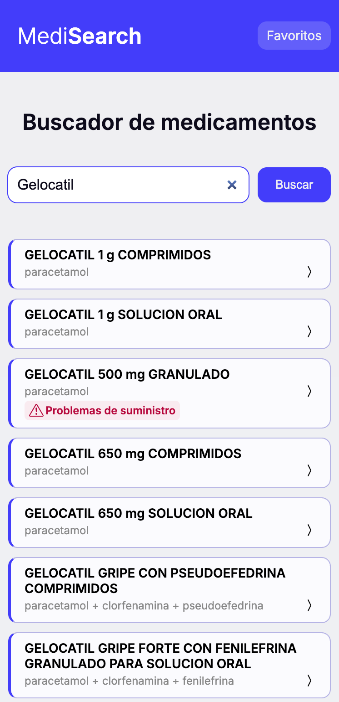

# MediSearch

Buscador de medicamentos autorizados en España. Consulta el principio activo, si necesita receta, si hay problemas de suministro y el prospecto oficial, con datos en tiempo real de la AEMPS.

**[Ver la aplicación](https://jocuni-p.github.io/medisearch-vanilla/)**

<p align="center">
  
  <br>
  <em>Vista móvil</em>
</p>

---

## Sobre el proyecto

MediSearch nació como un ejercicio personal para trabajar JavaScript nativo sin frameworks ni librerías de lógica: consumo asíncrono de una API pública, manipulación del DOM, gestión de estado y persistencia en el navegador, resolviendo cada pieza a mano.

El objetivo era doble: dominar los fundamentos antes de apoyarse en abstracciones, y construir algo que resolviera una necesidad real en lugar de un ejercicio de laboratorio.

**La necesidad.** La información oficial sobre medicamentos es pública, pero está pensada para uso profesional. Para alguien sin formación sanitaria, consultar CIMA resulta denso. MediSearch parte de una pregunta concreta: *¿qué necesita saber de un vistazo una persona cualquiera sobre un medicamento?* La respuesta es un subconjunto cuidado de esa información, presentado en lenguaje llano.

---

## Qué hace

- **Buscar** por nombre comercial, mostrando solo medicamentos actualmente comercializados y ordenados alfabéticamente.
- **Consultar la ficha**: identidad, foto del envase cuando existe, indicadores (receta, genérico, uso hospitalario, suministro), notas de seguridad y enlace al prospecto oficial.
- **Guardar favoritos**, que persisten entre sesiones en `localStorage`.
- **Compartir búsquedas**: el término viaja en la URL, así que un enlace lleva directamente a sus resultados.

---

## Stack

Sin frameworks, sin bundler, sin dependencias de lógica.

- **HTML5 semántico** — `header`, `main`, `nav`, `section`, `dl`/`dt`/`dd`, `template`, `noscript`.
- **CSS3** — custom properties para paleta y escala tipográfica, Flexbox y Grid, `color-mix()`, diseño responsive *mobile-first* desde 375px.
- **JavaScript (ES2023)** — módulos ES, `async`/`await`, `fetch` con `AbortSignal.timeout`, `Promise.allSettled`, `toSorted`, `localeCompare`, `URL`/`URLSearchParams`, `history.pushState`, `localStorage`.
- **Bootstrap Icons** (CDN) — única dependencia externa, solo iconografía.
- **GitHub Pages** — despliegue.

---

## Arquitectura

Patrón **MVC** con separación estricta de responsabilidades:

```
js/
├── controllers/     Orquestan cada página: leen la entrada, deciden el flujo,
│                    coordinan modelo y vista, gestionan errores. No tocan el DOM.
├── models/          Construyen URLs, hacen las peticiones, validan la respuesta
│                    y propagan errores. Encapsulan localStorage. No conocen el DOM.
└── views/           Traducen datos a nodos del DOM. Sin lógica de negocio.
```

Cada página tiene su HTML y su controller. Además hay módulos transversales:

| Módulo | Responsabilidad |
|---|---|
| `ui-state.view.js` | Estados de las operaciones asíncronas (carga, vacío, error, resultados, inicial) |
| `tags.view.js` | Genera los indicadores desde una tabla declarativa, única fuente de verdad |
| `form-validation.view.js` | Mensaje de validación del buscador y atributos ARIA del campo |
| `ui-messages.js` | Todos los textos de interfaz centralizados |
| `header.view.js` / `footer.view.js` | Cabecera sensible al contexto y pie comunes |

---

## Algunas decisiones

**Programación defensiva sobre datos externos.** Antes de escribir la interfaz se hizo un muestreo empírico de la API con cinco perfiles de medicamentos, ya que la documentación no marca qué campos son obligatorios. Aun con presencia del 100 % en los críticos, el código mantiene encadenamiento opcional en los accesos anidados, `URL`/`URLSearchParams` en lugar de concatenar cadenas y `encodeURIComponent` donde hace falta.

**Degradación parcial en favoritos.** La lista lanza una petición por medicamento guardado. Con `Promise.all`, un solo fallo dejaba la lista vacía. Con `Promise.allSettled`, los que cargan se muestran y cada fallo aparece como un elemento propio, apagado y sin enlace.

**Timeout en todas las peticiones.** `fetch` solo rechaza ante un fallo de red o una respuesta incorrecta: una petición que nunca vuelve deja el spinner girando indefinidamente. `AbortSignal.timeout` corta a los 5 s, valor medido sobre tiempos reales de 110-380 ms.

**Color y forma separados en el CSS.** Los indicadores existen en dos formas y cuatro colores. Las clases de color no aplican propiedades: declaran custom properties que las clases de forma consumen. Añadir una forma no requiere tocar ningún color, y viceversa.

**Fidelidad antes que estética.** Las notas de seguridad llegan con formato inconsistente, la mayoría en mayúsculas. Normalizarlas mejoraría el caso mayoritario pero destrozaría siglas y nombres propios, que en una nota de seguridad son lo importante. Se muestran tal como las publica el organismo oficial.

> **Consumir lo no documentado, con red.** CIMA expone fotografías del envase que no aparecen en la especificación de la API. Son útiles —permiten confirmar que la caja que tienes en la mano es la correcta— pero dependen de una ruta que nadie garantiza. Se consumen solo cuando el campo fotos está presente en la respuesta, de modo que no hay peticiones a ciegas, y un listener de error elimina la imagen si el recurso no responde. La app funciona igual con foto que sin ella.

**Alcance retirado a conciencia.** Se descartó una vista de listado global de problemas de suministro: existía porque el endpoint lo permitía, no porque nadie la necesitara. Funcionalidad guiada por la API y no por el usuario.

**Accesibilidad como requisito.** `role="status"` y `aria-live` en los estados asíncronos, técnica *visually-hidden* para el label del buscador, `aria-pressed` en el botón toggle de favoritos, `aria-describedby` y `aria-invalid` vinculando el error de validación a su campo, y `aria-hidden` en los iconos decorativos.

---

## Ejecutar en local

No hay dependencias que instalar ni claves de API: CIMA es pública y no requiere autenticación.

```bash
git clone https://github.com/jocuni-p/medisearch-vanilla.git
cd medisearch-vanilla
```

Sirve la carpeta con cualquier servidor estático — por ejemplo la extensión **Live Server** de VS Code — y abre la dirección local que aparezca.

> Es imprescindible servirlo desde un servidor: al usar módulos ES, abrir `index.html` directamente desde el sistema de archivos hace que el navegador bloquee su carga.

---

## Fuente de datos

[**CIMA REST API v1.19**](https://cima.aemps.es) — Agencia Española de Medicamentos y Productos Sanitarios (AEMPS). Endpoints consumidos: `/medicamentos`, `/medicamento`, `/psuministro` y `/notas`.

> Las fotos de envase se obtienen del campo fotos y de la ruta /cima/fotos/full/, que no figuran en la especificación v1.19. La URL de alta resolución se construye por patrón, así que un listener de error retira la imagen si la petición falla.

MediSearch es una interfaz de consulta que redirige a la fuente oficial. **No sustituye el consejo, diagnóstico o tratamiento de un profesional sanitario.**

---

## Limitaciones conocidas

- La búsqueda es solo por nombre comercial: quien busca «ibuprofeno» no encuentra Nurofen ni Espidifen.
- No hay paginación ni indicador del total; una búsqueda genérica devuelve una lista continua larga.
- Los favoritos solo pueden eliminarse desde la ficha de detalle.
- Sin pruebas automatizadas: la verificación es manual mediante listas de casos.

---

## Próximos pasos

- Eliminar favoritos desde el propio listado.
- Búsqueda por principio activo (`practiv1`), pendiente de resolver antes la navegabilidad de resultados.
- Paginación o scroll continuo con contador de resultados.
- Pruebas automatizadas sobre los casos de verificación actuales.

---

## Autor

**jocuni-p** — [GitHub](https://github.com/jocuni-p)
